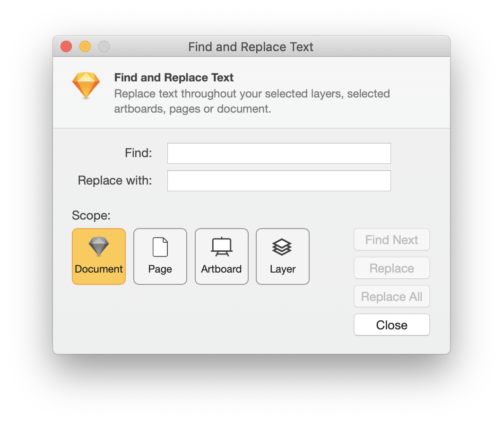

# 🕵🏻‍ Find and Replace Text plugin for Sketch

Find and Replace Text for Sketch allows you to search throughout your active document and replace text within canvas elements (symbol overrides included). You can also choose to perform a rename on just the layer names as well. Searches can be scoped at the following levels based on your current layer list selection: Document, Page, Artboard, Layer

## Installation

Download the [latest release](https://github.com/chriswetterman/sketch-find-and-replace-text/releases/latest/download/find-and-replace-text.sketchplugin.zip), unzip then double-click `find-and-replace-text.sketchplugin` to install.

## Usage

Launch Find and Replace Text from the Plugins menu or use the keyboard shortcut, **CMD+SHIFT+F**.

## Support

Find and Replace Text supports Sketch 53+. Please open an issue for any problems or feature requests!

